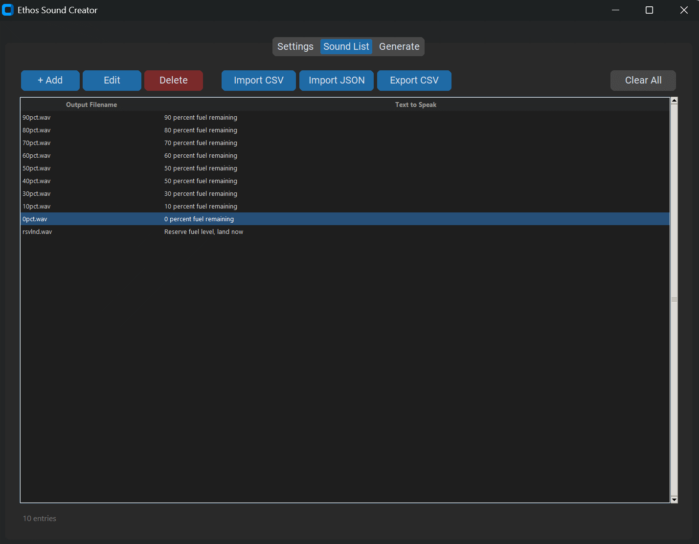

# Ethos Sound Creator

A Windows utility for generating custom audio files for FrSky Ethos and Rotorflight flight controller systems using Google Text-to-Speech.



---

## What It Does

Ethos Sound Creator lets you build your own sound packs for your radio transmitter. You maintain a list of filenames and the text you want spoken, choose a language and voice, and the app generates correctly-formatted WAV files ready to copy to your transmitter's SD card.

Audio files are generated using Google's Text-to-Speech API — the same voices used by the official Rotorflight sound packs — and are automatically encoded in the A-law 16kHz mono format required by FrSky Ethos.

---

## Features

- **11 languages** — English, French, German, Spanish, Italian, Dutch, Portuguese (Brazil), Norwegian, Czech, Polish, Chinese (Simplified)
- **Official voice presets** — voice combinations matched to the Rotorflight sound pack standard
- **Import CSV or JSON** — load entries from existing CSV files or directly from Rotorflight's JSON language files
- **Export CSV** — save your sound list for sharing or backup
- **Skip existing files** — only generate what's missing, saving API calls
- **Persistent settings** — API key, voice, speed, and output directory are remembered between sessions
- **No extra binaries** — no sox or ffmpeg required; audio processing is handled in Python

---

## Requirements

- Windows 10 or 11
- Python 3.10 or newer
- A Google Cloud API key with Text-to-Speech enabled

---

## Installation

**1. Install Python dependencies:**

```
pip install -r requirements.txt
```

**2. Run the app:**

```
python app.py
```

---

## Getting a Google API Key

See **[SETUP_GOOGLE_KEY.md](SETUP_GOOGLE_KEY.md)** for a step-by-step guide. The process takes about 10 minutes and is free for normal use (Google's free tier covers approximately 100 full sound pack generations per month).

The app also has a **? Guide** button next to the API Key field that opens the guide directly.

---

## Quick Start

1. Open the **Settings** tab, paste your Google API key and click **Test** to verify it
2. Choose your **Language** and **Voice**
3. Set your **Output Directory** (where WAV files will be saved)
4. Open the **Sound List** tab and add entries, or use **Import CSV / Import JSON** to load an existing list
5. Go to the **Generate** tab and click **▶ Generate All**

---

## Importing Official Rotorflight Sound Lists

The **Import JSON** button accepts the language JSON files from the [rotorflight-lua-ethos-suite](https://github.com/rotorflight/rotorflight-lua-ethos-suite) repository. Clone that repo and import any file from `bin/sound-generator/json/` to get the full official sound list for that language instantly.

**Import CSV** accepts any CSV with at least two columns: `filename` and `text`. The first row is treated as a header and skipped.

---

## Example Files

The [examples/](examples/) folder contains the original CSV files from the Ethos project as a starting point:

| File | Contents |
|---|---|
| `examples/user.csv` | RTRC flight mode callouts and system alerts |
| `examples/en.csv` | Numbers 0–250 for numeric voice feedback |
| `examples/rfsuite.csv` | Rotorflight Suite app and status sounds |

---

## Building a Standalone .exe

To distribute the app without requiring Python to be installed, run:

```
build.bat
```

This uses PyInstaller to produce a single `dist\EthosSoundCreator.exe` that includes all dependencies. Requires PyInstaller (`pip install pyinstaller`).

---

## Audio Format

Generated WAV files match the specification required by FrSky Ethos:

| Property | Value |
|---|---|
| Encoding | A-law (G.711) |
| Sample rate | 16,000 Hz |
| Channels | Mono |
| Bit depth | 8-bit |

---

## Supported Languages and Voices

| Language | Voice |
|---|---|
| English | US Female (Wavenet F) |
| English | UK Female (Neural2 A) |
| French | Female / Femme (Neural2 F) |
| French | Male / Homme (Standard B) |
| German | Female (Wavenet E) |
| Spanish | Female (Wavenet C) |
| Italian | Female (Wavenet B) |
| Dutch | Female (Standard A) |
| Portuguese (Brazil) | Female (Wavenet A) |
| Norwegian | Female (Standard E) |
| Czech | Female (Wavenet A) |
| Polish | Female (Wavenet A) |
| Chinese (Simplified) | Female (Wavenet A) |

Voice selection is based on the voices used by the official [Rotorflight](https://github.com/rotorflight) sound packs.
